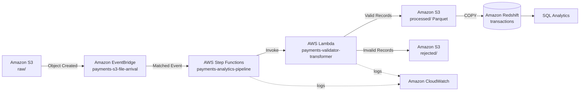
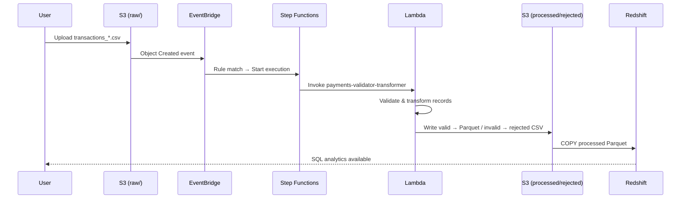
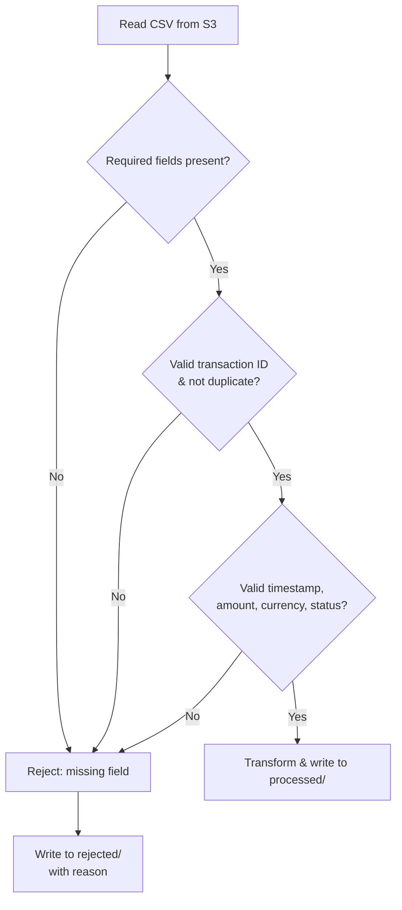

# AWS Serverless ETL Analytics Pipeline

An event-driven, serverless data pipeline that ingests payment transaction files from Amazon S3, validates and transforms them with AWS Lambda, orchestrates the workflow with AWS Step Functions, and loads the results into Amazon Redshift for SQL-based analytics.

Built to demonstrate a realistic, production-style AWS data engineering pattern — no polling, no always-on servers, fully event-driven.

---

## Why This Project

Payment transaction files arrive continuously and need to be ingested, validated, and made queryable with minimal manual intervention. A naive approach would use a scheduled job that polls storage for new files. This project instead reacts to file arrival in real time using AWS-native eventing, and separates orchestration (Step Functions) from processing logic (Lambda) so the pipeline can scale and evolve independently.

**Goals:** event-driven ingestion, automated validation/transformation, clean separation of valid vs. rejected data, and an analytics-ready warehouse layer — all serverless.

---

## Architecture



## AWS Services

| Service | Role |
|---|---|
| **Amazon S3** | Landing zone for raw files, and storage for processed (Parquet) and rejected output |
| **Amazon EventBridge** | Detects S3 object-created events and filters for the `raw/` prefix |
| **AWS Step Functions** | Orchestrates the workflow and invokes Lambda |
| **AWS Lambda** | Validates, transforms, and splits records into valid/rejected |
| **Amazon Redshift** | Analytical warehouse queried via SQL |
| **AWS IAM** | Service-to-service permissions (no hard-coded credentials) |
| **Amazon CloudWatch** | Logging and monitoring across every stage |

## How It Works

1. **A CSV file lands in S3.** Transaction files are uploaded to the `raw/` prefix of the `payments-analytics-2026` bucket — this is the only entry point into the pipeline.
2. **S3 emits an event, EventBridge catches it.** S3 automatically emits an "Object Created" event for every new file. EventBridge is subscribed to these events and applies a rule that only matches files under `raw/`, so nothing else in the bucket (including the pipeline's own output) can accidentally start a new run.
3. **EventBridge starts the Step Functions workflow.** A rule match triggers an execution of the `payments-analytics-pipeline` state machine, which owns the workflow from this point forward.
4. **Step Functions invokes Lambda.** The state machine calls `payments-validator-transformer`, passing along the bucket and object key so Lambda knows exactly which file to process.
5. **Lambda validates and transforms the data.** It reads the CSV, checks required fields, transaction IDs, duplicates, timestamps, amounts, currency, and status, then converts valid rows into a partitioned Parquet file.
6. **Records are split into two outputs.** Rows that pass validation go to `processed/`; anything that fails goes to `rejected/` along with the reason, so bad data never blocks good data from moving forward.
7. **Processed data is loaded into Redshift.** The Parquet files in `processed/` are loaded into the `transactions` table using Redshift's `COPY` command, which is fast for bulk, columnar data.
8. **Analysts query Redshift with SQL.** Once loaded, the data is available for standard SQL analytics — transaction volume, fraud counts, regional breakdowns, and more.

Every stage above also writes to CloudWatch, so if something fails, the logs and Step Functions execution history make it possible to trace exactly where and why.

---

## End-to-End Data Flow

The diagram below shows the same steps as a timeline of interactions between services, from the moment a file is uploaded to the moment it's queryable in Redshift.



**Lambda validation logic** (per record): Lambda evaluates each row in the file individually, rather than accepting or rejecting the whole file at once. A record only reaches `processed/` after it passes every check below; failing any single check routes it to `rejected/` with the specific reason attached, so the cause of a rejection is never lost.



---

## EventBridge Rule

The rule `payments-s3-file-arrival` only triggers on files landing under `raw/`, keeping a clean boundary between incoming and pipeline-generated output (so processed/rejected writes never re-trigger the workflow):

```json
{
  "source": ["aws.s3"],
  "detail-type": ["Object Created"],
  "detail": {
    "bucket": { "name": ["payments-analytics-2026"] },
    "object": { "key": [{ "prefix": "raw/" }] }
  }
}
```

---

## Redshift Schema

Redshift is used as the analytics layer rather than S3 alone because it supports fast, indexed SQL queries and aggregations across millions of rows — something that's slow and clumsy to do by querying Parquet files directly. Processed Parquet files are loaded into a single analytical table, `transactions`, using the `COPY` command, which reads directly from S3 in parallel rather than inserting rows one at a time:

| Column | Type |
|---|---|
| transaction_id | VARCHAR |
| transaction_ts | TIMESTAMP |
| merchant_id | VARCHAR |
| customer_id | VARCHAR |
| payment_method_id | VARCHAR |
| amount | DECIMAL |
| currency | VARCHAR |
| status | VARCHAR |
| is_fraud_flag | BOOLEAN |
| device_type | VARCHAR |
| region | VARCHAR |

**Analytics Queries**

```sql
-- Transactions by status
SELECT status, COUNT(*) AS transaction_count
FROM transactions
GROUP BY status
ORDER BY transaction_count DESC;

-- Fraud transactions
SELECT COUNT(*) AS fraud_transactions
FROM transactions
WHERE is_fraud_flag = TRUE;
```

---

## Testing

The pipeline was validated end to end using real transaction CSV uploads:

| Test | Result |
|---|---|
| S3 event detection | ✅ Object-created event fired on upload to `raw/` |
| EventBridge rule match | ✅ `payments-s3-file-arrival` matched correctly |
| Step Functions trigger | ✅ `payments-analytics-pipeline` started automatically |
| Lambda execution | ✅ `payments-validator-transformer` ran successfully |
| Data processing | ✅ 557 valid records, 3 rejected records on a sample run |
| Multi-file processing | ✅ Independent executions for concurrent file uploads |


---

## Monitoring

- **EventBridge:** matched events, invocations, failed invocations, latency
- **Step Functions:** full execution history (`ExecutionStarted` → `TaskSucceeded` → `ExecutionSucceeded`), making it easy to pinpoint failures
- **Lambda:** CloudWatch Logs covering source file, validation results, error messages, and execution duration

---

## Security

- No AWS access keys, secret keys, or passwords are stored in this repository
- All service-to-service access uses **IAM roles** (EventBridge → Step Functions → Lambda → S3, and Redshift → S3)
- The repo contains configuration examples only, not live credentials

---

## Project Structure

Each folder maps directly to one stage of the pipeline, so the code for a given service lives in exactly one place — `lambda/` for the processing logic, `eventbridge/` and `step-functions/` for the event/orchestration config, and `redshift/` for the warehouse schema and queries.

```
AWS_Serverless_ETL_Analytics_Pipeline/
│
├── README.md
├── lambda/
│   └── payments-validator-transformer.py
├── eventbridge/
│   └── payments-s3-file-arrival.json
├── step-functions/
│   └── payments-analytics-pipeline.json
└── redshift/
    ├── Create_table.sql
    ├── Load_data.sql
    └── Analytics_queries.sql
```
---

## Key Design Decisions

- **EventBridge over direct S3 → Lambda trigger** — adds an explicit, filterable event-routing layer and keeps the architecture easy to extend with new targets.
- **Step Functions for orchestration** — decouples workflow control from processing logic, making it straightforward to insert new stages (enrichment, notifications, etc.) later.
- **Separate valid/rejected outputs** — a single bad record never blocks the rest of the batch.
- **Parquet for processed data** — columnar storage suited for Redshift `COPY` and analytical querying.

---

## Tech Stack

`AWS S3` · `AWS EventBridge` · `AWS Step Functions` · `AWS Lambda` · `Amazon Redshift` · `AWS IAM` · `Amazon CloudWatch` · `Python` · `SQL` · `Parquet`

---

## Author

**Abhijeet Mathur** — Data Engineer
[GitHub](https://github.com/abhijeetmathur) · [Repository](https://github.com/abhijeetmathur/AWS_Serverless_ETL_Analytics_Pipeline)

> This project is a learning / proof-of-concept build. Infrastructure configuration and AWS costs will vary depending on account, region, and services used.
